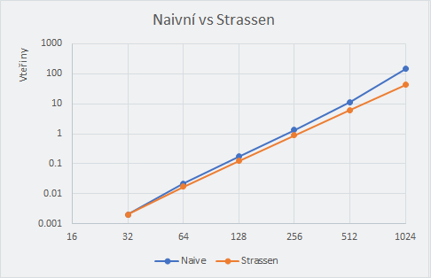

# Zadání
## Násobení matic
Násobení matic je jedna z výpočetně nejzajímavějších operací v lineární algebře. Zaprvé protože je velmi časté, zadruhé protože je to operace, která dobře naimplementovaná opravdu může dosáhnout limitu výpočetní rychlosti procesoru (narozdíl třeba od sčítání vektorů, které jsou omezeny rychlostí přístupu do paměti).

# Implementace
Od začátku jsem plánoval pooužít Strassenův algoritmus, z počátku jsem měl problémy s jeho implementací (funguje jen pro čtvercové matice NxN, kde N nějakou druhou mocninou 2), tak jsem se nejdříve rozhodl zkusit implementovat rekurzivní algoritmus, ten byl ale ve výsledku pomalejší než naivní řešení (dle definice) s navíc při větších rozměrech matic skončil s přetečením zásobníku. Nakonec jsem tedy implementoval Strassenův algoritmus, ten byl nejprve mnohem pomalejší než naivní řešení, kvůli špatnému dělení matic na menší. Nakonec se mi podařilo tuto část zoptimalizovat a dosáhnout lepších výsledků než s naivním řešením. Nakonec jsem spojil naivní řešení (pro matice, na které nejde použít Strassen) a Strassenův algoritmus.

# Měření
Zde můžeme sledovat dosažené výsledky:
| Size      | Naive  | Recursive | Strassen |
|-----------|--------|-----------|----------|
| 16x16     |      0 |         0 |        0 |
| 25x25     |      1 |         1 |        x |
| 32x32     |      2 |         3 |        1 |
| 50x50     |     10 |        16 |        x |
| 64x64     |     22 |         x |       15 |
| 100x100   |     83 |         x |        x |
| 128x128   |    174 |         x |      150 |
| 250x250   |   1339 |         x |        x |
| 256x256   |   1358 |         x |     1016 |
| 500x500   |  10650 |         x |        x |
| 512x512   |  11297 |         x |     8194 |
| 1000x1000 |  85108 |         x |        x |
| 1024x1024 | 146436 |         x |    65238 |

